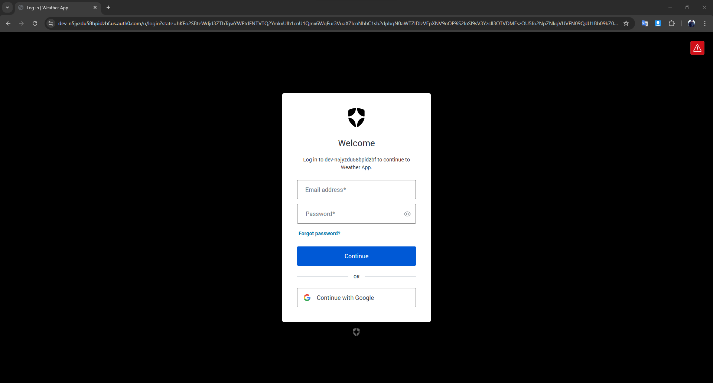
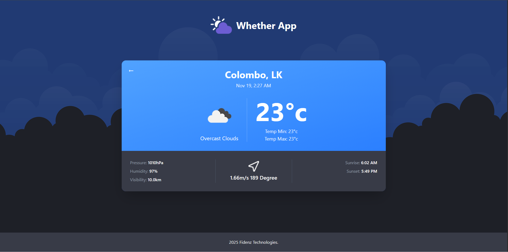

# 🌤️ Weather App

A full-stack weather application built with **React** and **Spring Boot**, featuring **Auth0 authentication**, real-time weather data from OpenWeatherMap API and a modern responsive UI.


---

## 📋 Table of Contents

- [Preview](#-preview)
- [Features](#-features)
- [Tech Stack](#-tech-stack)
- [Installation & Setup](#-installation--setup)
- [Running the Application](#-running-the-application)
- [Project Structure](#-project-structure)
- [API Endpoints](#-api-endpoints)
- [Authentication](#-authentication)
- [Troubleshooting](#-troubleshooting)

---

## 🎥 Preview

### Login Screen
<div align="center">


*Clean and modern login interface with Auth0 integration*
</div>

---

### Weather Dashboard
<div align="center">


*Responsive grid layout showing weather cards for multiple cities with color-coded designs*
</div>

---

### Expanded Weather View
<div align="center">


*Detailed weather information including temperature, humidity, wind speed, and sunrise/sunset times*
</div>

---

### Mobile Responsive Design
<div align="center">


*Fully optimized mobile experience with touch-friendly interfaces*
</div>


---

## ✨ Features

### 🔐 Authentication & Security
- **Auth0 Authentication** with Multi-Factor Authentication (MFA)
- **JWT Token Validation** on backend
- **Email verification** for enhanced security
- **Disabled public signups** 
- **Secure OAuth2 flow** with CORS configuration

### 🌍 Weather Functionality
- **Real-time Weather Data** from OpenWeatherMap API
- **Auto-refresh** weather data every 5 minutes
- **Backend caching** (5-minute cache for optimized performance)
- **Multiple cities** with color-coded cards
- **Detailed weather information**

### 🎨 UI/UX Features
- **Responsive Design** with Tailwind CSS
- **Mobile-responsive** weather cards
- **Expandable cards** - click for detailed view
- **ID-based color coding** for different cities
- **Remove city** functionality (click × button)

### ⚡ Performance
- **Fast API responses** with Spring Boot
- **Reduced OpenWeatherMap API calls** through caching
- **Optimized production builds**
- **Vite** for lightning-fast development

---

## 🛠️ Tech Stack

### Frontend
- **React 19.2.0** - UI framework
- **Vite 7.2.2** - Build tool
- **Tailwind CSS 4.1.17** - Styling
- **Auth0 React SDK 2.9.0** - Authentication
- **Axios 1.13.2** - HTTP client

### Backend
- **Spring Boot 3.5.7** - Framework
- **Spring Security** - Security & JWT validation
- **Spring OAuth2 Resource Server** - Token validation
- **Caffeine Cache** - Caching mechanism
- **Lombok** - Boilerplate reduction
- **WebFlux** - Reactive HTTP client

### APIs & Services
- **OpenWeatherMap API** - Weather data
- **Auth0** - Authentication & authorization

---

## 🚀 Installation & Setup

All configurations are **already set up** in the repository. Just follow these simple steps:

### 1. Clone the Repository

```bash
git clone https://github.com/NavinduR2001/weather-app.git
cd weather-app
```

### 2. Frontend Setup

```bash
cd frontend
npm install
```

✅ **That's it!** All environment variables are pre-configured in `frontend/.env`

### 3. Backend Setup

```bash
cd backend
mvn clean install
```

✅ **That's it!** All configurations are pre-set in `backend/src/main/resources/application.properties`

---

## 🏃 Running the Application

### Start Backend (Terminal 1)

```bash
cd backend
mvn spring-boot:run
```

✅ Backend runs on: **http://localhost:8080**

### Start Frontend (Terminal 2)

```bash
cd frontend
npm run dev
```

✅ Frontend runs on: **http://localhost:5173**

### Access the Application

Open your browser and navigate to: **http://localhost:5173**

---

## 🔐 Test Credentials

Use these credentials to test the application:

```
Email: careers@fidenz.com
Password: Pass#fidenz
```

---

## 📁 Project Structure

```
weather-app/
├── frontend/                   # React frontend
│   ├── src/
│   │   ├── assets/            # Images, icons
│   │   ├── components/        # React components
│   │   │   ├── Auth/          # Auth0 components (Login, Logout)
│   │   │   ├── WeatherCard.jsx
│   │   │   ├── WeatherList.jsx
│   │   │   └── Footer.jsx
│   │   ├── services/          # API services
│   │   │   └── weatherConnection.js
│   │   ├── App.jsx            # Main app component
│   │   ├── main.jsx           # Entry point
│   │   └── index.css          # Global styles
│   ├── .env                   # Pre-configured
│   ├── package.json
│   └── vite.config.js
│
├── backend/                    # Spring Boot backend
│   ├── src/
│   │   ├── main/
│   │   │   ├── java/com/weather/app/
│   │   │   │   ├── config/    # Security & Cache config
│   │   │   │   ├── controller/# REST controllers
│   │   │   │   ├── model/     # Data models
│   │   │   │   ├── service/   # Business logic
│   │   │   │   └── AppApplication.java
│   │   │   └── resources/
│   │   │       ├── application.properties  # Pre-configured
│   │   │       └── cities.json
│   └── pom.xml
│
├── .gitignore
└── README.md
```

---

## 🔌 API Endpoints

All endpoints require **JWT authentication**.

| Method | Endpoint | Description |
|--------|----------|-------------|
| GET | `/api/weather/cities` | Get all city IDs |
| GET | `/api/weather/{cityId}` | Get weather for specific city |
| GET | `/api/weather/all` | Get weather for all cities |

---

## 🔐 Authentication

### Auth0 Setup

The application uses **Auth0** with:
- ✅ JWT token validation
- ✅ Multi-Factor Authentication (Email verification)
- ✅ Disabled public signups (only pre-registered users)
- ✅ Secure OAuth2 flow

### Authentication Flow

1. **User clicks "Log In"** → Redirected to Auth0
2. **Enter credentials** → Email: `careers@fidenz.com`, Password: `Pass#fidenz`
3. **Email verification** (MFA)
4. **Auth0 returns JWT token** → Stored in frontend
5. **Token sent with API requests** → Backend validates
6. **Weather data displayed** → Authenticated access

---

## 🎯 Key Features

### Weather Cards
- 📱 **Responsive grid**: 2 columns on desktop, 1 on mobile
- 🎨 **Color-coded by city**: Each city has unique gradient
- 🔍 **Expandable view**: Click card for detailed weather
- 🔄 **Auto-refresh**: Updates every 5 minutes
- ❌ **Remove city**: Click × to remove from view

### Performance
- ⚡ **Backend caching**: 5-minute cache for weather data
- 🚀 **Fast API responses**: Reduced OpenWeatherMap calls
- 📦 **Optimized builds**: Production-ready bundles

### Security
- 🔒 **JWT validation**: All API calls protected
- 🛡️ **CORS configured**: Secure cross-origin requests
- 🔐 **MFA enabled**: Enhanced security layer

---

## 🐛 Troubleshooting

### Backend Won't Start

```bash
# Check Java version (must be 17+)
java -version

# Clean and rebuild
cd backend
mvn clean install
mvn spring-boot:run
```

### Frontend Won't Connect

```bash
# Ensure backend is running on port 8080
# Check browser console for errors
# Verify .env file exists in frontend folder
```

### Auth0 Login Issues

- ✅ Check if backend is running (port 8080)
- ✅ Clear browser cache and cookies
- ✅ Try in incognito/private mode
- ✅ Verify test credentials

---

## 👨‍💻 Author

**Navindu Kavishka Ramanayaka**
- GitHub: [@NavinduR2001](https://github.com/NavinduR2001)
- Email: navinduramanayaka.com
- Portfolio: [navinduramanayaka.me](https://www.navinduramanayaka.me/)

---

## 🙏 Acknowledgments

- **Fidenz Technologies** - Project requirements and guidelines.
- **Spring Boot & React** communities
- **OpenWeatherMap** - Weather data API
- **Auth0** - Authentication services

---

## 📄 License

This project is created for educational and interview demonstration purposes.

---

**Quick Start**: Just clone, install dependencies, and run! All configurations are ready to go! 🚀